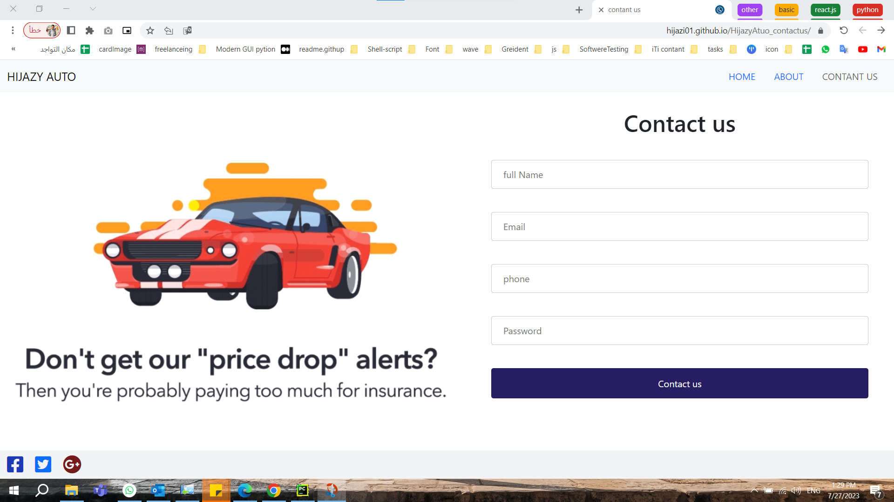

# Hijazy Atuo 

It is a website that is a simple car store consisting of a number of pages .

## Installation

Use the  command line  [git clone]()  to install DBMS in VSCode.

[git@github.com:Hijazi01/HijazyAtuo-Home.git](git@github.com:Hijazi01/HijazyAtuo-Home.git) 

```bash
git clone git@github.com:Hijazi01/HijazyAtuo-Home.git

```

## All Page in Website 

Use  [git clone]()  to download in VS Code.

code : 
[https://github.com/Hijazi01/HijazyAtuo-Home](https://github.com/Hijazi01/HijazyAtuo-Home)
 
code : 
[https://github.com/Hijazi01/HijazyAtuo_About.git](https://github.com/Hijazi01/HijazyAtuo_About.git) 

code : 
[https://github.com/Hijazi01/HijazyAtuo_contactus.git](https://github.com/Hijazi01/HijazyAtuo_contactus.git)


## All Page in Website 

Demo : 
[https://github.com/Hijazi01/HijazyAtuo-Home](https://github.com/Hijazi01/HijazyAtuo-Home)
 
Demo : 
[https://github.com/Hijazi01/HijazyAtuo_About.git](https://github.com/Hijazi01/HijazyAtuo_About.git) 

Demo : 
[https://github.com/Hijazi01/HijazyAtuo_contactus.git](https://github.com/Hijazi01/HijazyAtuo_contactus.git)


## Some screenshots of the Website

ONE SCREEN :




1. Adding a GIF from an external URL to markdown.


2. Adding a local GIF file to markdown.


